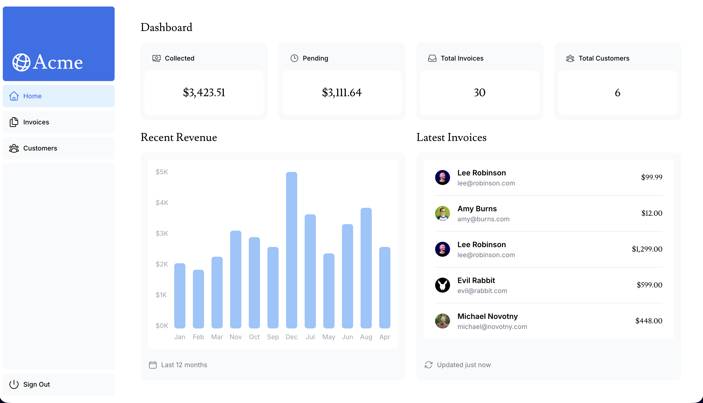
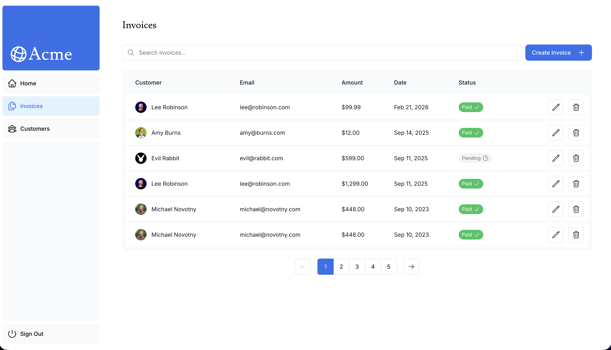
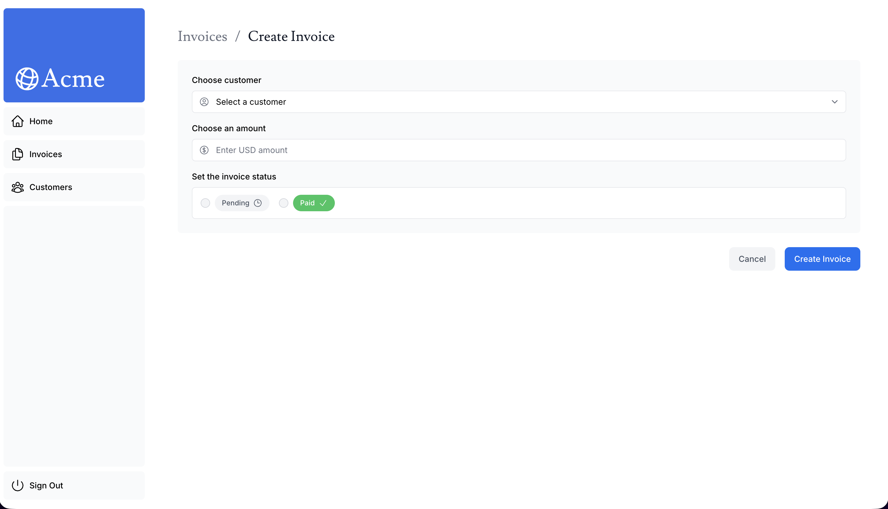

# Next.js Dashboard App

A full-stack dashboard application built by following the official [Next.js Learn Course](https://nextjs.org/learn/dashboard-app) (App Router, all 15 chapters).

## Screenshots

<table>
  <tr>
    <td></td>
    <td></td>
    <td></td>
  </tr>
  <tr>
    <td align="center">Dashboard</td>
    <td align="center">Invoices</td>
    <td align="center">Create Invoice</td>
  </tr>
</table>

## What I Learned

- App Router: layouts, pages, dynamic routes, route groups
- Data fetching with server components and streaming with Suspense
- Search, pagination, and URL state management with `searchParams`
- Server Actions for mutating data (create, update, delete)
- Form validation with Zod and accessible error handling
- Authentication with NextAuth.js (credentials provider, middleware route protection)
- Metadata API for SEO (title templates, Open Graph images)
- Partial prerendering and static vs dynamic rendering

## Tech Stack

- **Framework:** Next.js 15 (App Router)
- **Language:** TypeScript
- **Database:** PostgreSQL (Neon)
- **Auth:** NextAuth.js v5
- **Styling:** Tailwind CSS
- **Validation:** Zod

## Getting Started

```bash
pnpm install
```

Create a `.env` file with your database and auth credentials:

```env
POSTGRES_URL=your_postgres_connection_string
AUTH_SECRET=your_auth_secret  # Generate with: openssl rand -base64 32
```

Run the development server:

```bash
pnpm dev
```

Open [http://localhost:3000](http://localhost:3000).

## Database Setup

This project uses a seeded PostgreSQL database from [Chapter 6](https://nextjs.org/learn/dashboard-app/setting-up-your-database) of the tutorial. The seed script creates sample invoices, customers, revenue data, and a test user for authentication. If you're setting up your own database, follow the seeding instructions in the tutorial.
